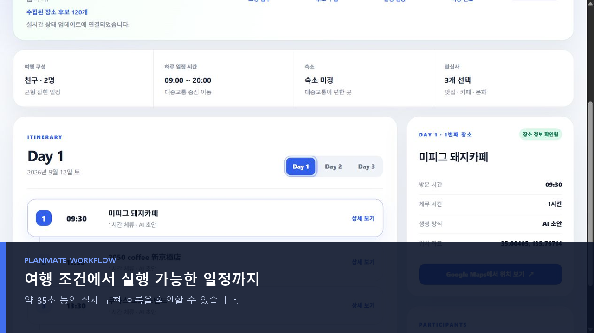

# PlanMate

사용자 조건과 실제 장소 후보를 바탕으로 검증 가능한 여행 일정을 만드는 개인 프로젝트입니다.

현재 일정 생성 경로는 Transactional Outbox, Debezium CDC, RabbitMQ Worker로 분리되어 있으며, 중복 전달과 Worker 중단을 고려한 Claim/Lease/Fencing, Retry/DLQ, Prometheus/Grafana 관측 구조를 포함합니다. AI 일정 생성은 서버가 외부 AI API를 직접 호출하지 않는 manual handoff 방식입니다.

## 35초 제품 데모

로그인부터 목적지·여행 조건 입력, 비동기 일정 생성 완료, 날짜별 상세 조회까지 실제 로컬 실행 화면으로 구성했습니다. 이미지를 누르면 MP4 데모가 열립니다.

`사용자 입력 → Trip·Outbox 원자적 저장 → Debezium CDC → RabbitMQ → Worker 검증·저장 → 상세 화면 조회`

상세 화면에서는 생성 단계와 수집 후보 수를 확인하고, Day 탭으로 날짜별 방문 순서·시간·장소 위치를 탐색할 수 있습니다.

## 문서

- [장애 주입 테스트 공식 Run 목록](docs/reliability-tests/README.md)
- [Debezium 중단 후 재시작 장애 주입 테스트 결과](docs/reliability-tests/runs/debezium-stop-restart-20260828-173040/README.md)
- [ACK 이전 Worker 강제 종료 장애 주입 테스트 결과](docs/reliability-tests/runs/worker-before-ack-termination-20260828-211457/README.md)
- [CDC Offset 불일치와 과거 이벤트 재전달 장애 주입 테스트 결과](docs/reliability-tests/runs/cdc-offset-mismatch-replay-20260828-220606/README.md)
- [Retry 분류와 DLQ 격리 장애 주입 테스트 결과](docs/reliability-tests/runs/retry-classification-dlq-20260828-223237/README.md)
- [Stale Generation 자동 복구와 Fencing 장애 주입 테스트 결과](docs/reliability-tests/runs/stale-generation-recovery-20260828-225751/README.md)
- [RabbitMQ 중단 중 CDC 발행 실패와 복구 장애 주입 테스트 결과](docs/reliability-tests/runs/rabbitmq-outage-recovery-20260828-233213/README.md)
- [RabbitMQ 전달 후 Claim 이전 Worker 강제 종료 장애 주입 테스트 결과](docs/reliability-tests/runs/worker-before-claim-termination-20260829-002951/README.md)
- [로컬 인프라 실행 방법](infra/README.md)
- [일정 생성 Worker 실패와 DLQ 운영 정책](docs/itinerary-generation-dlq.md)
- [수동 AI 일정 생성 검증 방법](docs/manual-itinerary-verification.md)

## 저장소

- 현재 개발 저장소: <https://github.com/BapEgg/plan-mate>
- 2026년 F-Lab 멘토링 기간의 PR·Issue 이력: <https://github.com/f-lab-edu/plan-mate>

새 작업은 현재 개발 저장소의 Issue와 짧은 수명 브랜치에서 진행합니다. 이전 저장소는 구현 배경과 리뷰 이력을 확인하는 기록 보관소로 사용합니다.
