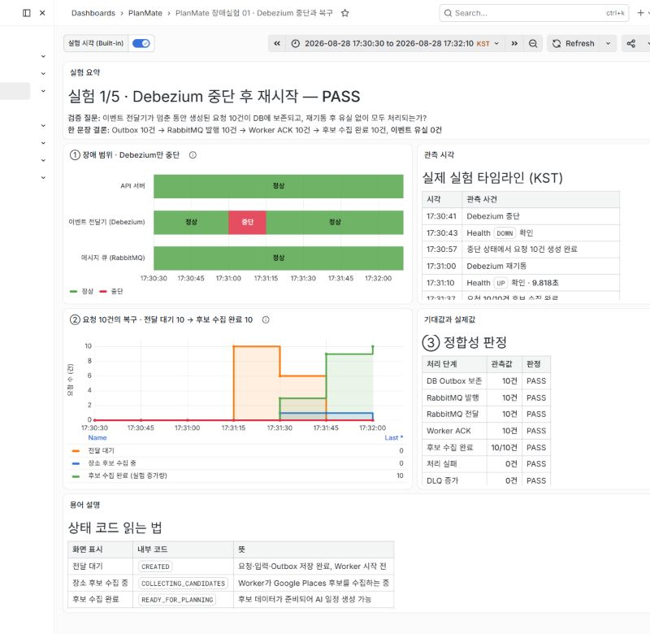
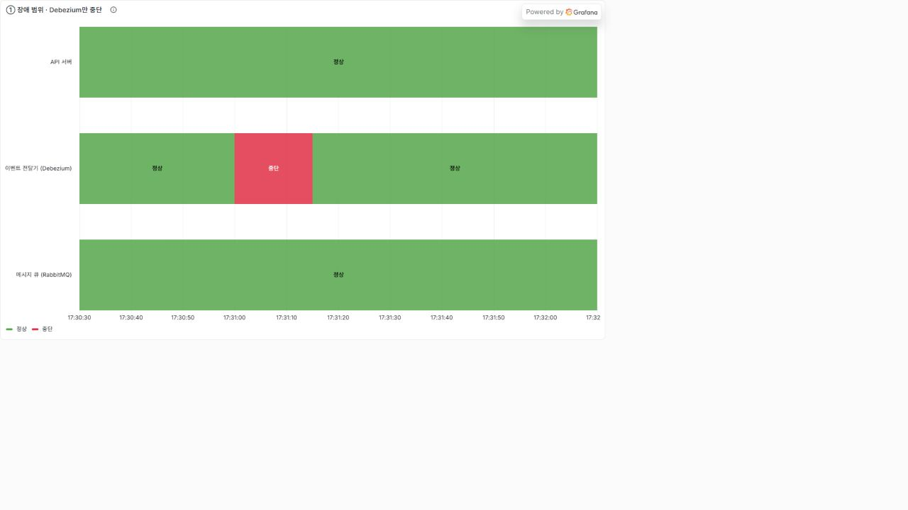
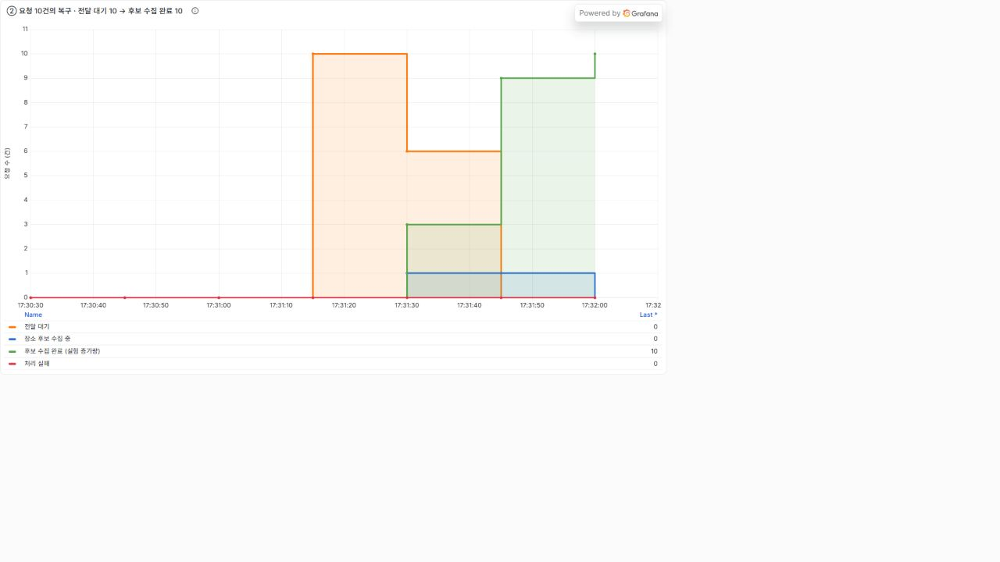
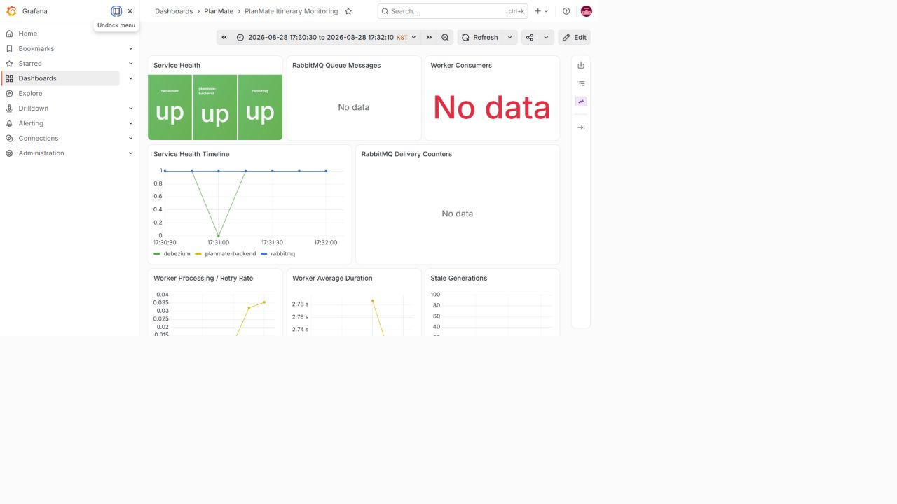
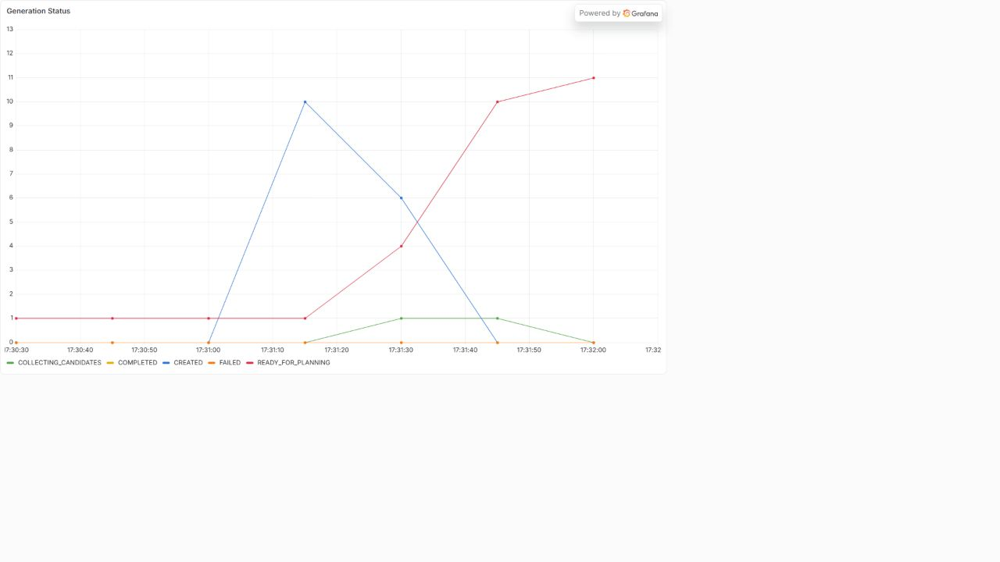
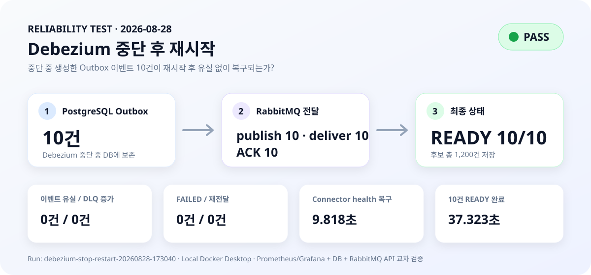

# Debezium 중단 후 재시작 결과

- 실행 ID: `debezium-stop-restart-20260828-173040`
- 실험 일시: 2026-08-28 17:30:40 ~ 17:31:59 KST
- Git 커밋: `49312494b486e91e9b1ef0e55730cd366117fb88`
- 테스트 요청: 10건
- 최종 판정: **PASS**

## 실행 환경

- Windows + Docker Desktop 로컬 환경
- PostgreSQL 17, RabbitMQ 4 Management, Debezium Server 3.5
- `APP_ITINERARY_MANUAL_HANDOFF_ENABLED=true`
- `APP_ITINERARY_GENERATION_WORKER_ENABLED=true`
- Prometheus 수집 간격 15초
- Windows 예약 포트 범위에 5432가 포함되어 호스트 PostgreSQL 포트는 15432를 사용했다. 컨테이너 내부와 Debezium의 PostgreSQL 포트는 5432 그대로다.

## 한 문장 결론

Debezium 중단 중 생성한 Outbox 이벤트 10건은 PostgreSQL에 보존됐고, 재시작 후 RabbitMQ를 거쳐 10건 모두 `READY_FOR_PLANNING`으로 전환됐다. 이벤트 유실, 실패, DLQ 증가, 재전달은 모두 0건이었다.

## 정상 기준선

- 백엔드 전체 테스트: 342개 통과, 실패 0개
- 정상 여행: `장애테스트-정상동작확인`
- 정상 Generation ID: `1116`
- 정상 결과: `READY_FOR_PLANNING`, 후보 120건

## 장애 주입 조건

1. `planmate-debezium` 컨테이너를 중단했다.
2. `장애테스트-데비지움중단-01`부터 `10`까지 여행과 Generation을 생성했다.
3. 중단 상태의 DB와 RabbitMQ를 측정했다.
4. Debezium을 재시작했다.
5. Debezium health, Prometheus, RabbitMQ, Generation 상태를 관측했다.

## 핵심 결과

| 항목 | 결과 | 판정 |
| --- | ---: | --- |
| 중단 중 생성된 Outbox 이벤트 | 10건 | PASS |
| 중단 중 RabbitMQ publish 증가 | 0건 | PASS |
| 재시작 후 RabbitMQ publish 증가 | 10건 | PASS |
| 재시작 후 RabbitMQ deliver 증가 | 10건 | PASS |
| 안정화 후 RabbitMQ ACK 증가 | 10건 | PASS |
| READY_FOR_PLANNING | 10/10건 | PASS |
| 저장된 후보 | 1,200건, Generation당 120건 | PASS |
| FAILED | 0건 | PASS |
| DLQ 증가 | 0건 | PASS |
| 재전달 | 0건 | PASS |
| 이벤트 유실 | 0건 | PASS |
| Connector health 복구 시간 | 9.818초 | PASS |
| 10건 READY 완료 시간 | 재시작 후 37.323초 | PASS |

DLQ에는 실험 전에 이미 167건이 있었으므로 절대값이 아니라 실험 전후 증가량으로 판정했다. 실험 중 다른 요청은 실행하지 않았다.

## 타임라인

| 시각(KST) | 사건 |
| --- | --- |
| 17:30:41.672 | Debezium Stop |
| 17:30:43.457 | Debezium health DOWN 확인 |
| 17:30:55.590 | Prometheus가 Debezium DOWN 관측 |
| 17:30:57.091 | 테스트 요청 10건 생성 완료 |
| 17:31:00.607 | Debezium Start |
| 17:31:10.426 | Debezium health UP 확인 |
| 17:31:10.443 | Prometheus가 Debezium UP 관측 |
| 17:31:37.930 | 10건 모두 READY 확인 |
| 17:31:59.219 | Queue ready 0, unacked 0, ACK 증가 10 재확인 |

## 예상과 실제 비교

| 구분 | 예상 | 실제 |
| --- | --- | --- |
| 중단 중 Outbox | 10건 보존 | 10건 보존 |
| 중단 중 메시지 전달 | 새 publish 없음 | publish 증가 0건 |
| 재시작 후 전달 | 10건 전달 | publish/deliver 각각 10건 증가 |
| 최종 상태 | 10건 모두 READY | 10건 모두 READY |
| 이벤트 유실 | 0건 | 0건 |
| DLQ | 증가 없음 | 증가 0건 |
| 관측 가능성 | Grafana에서 DOWN → UP | Prometheus 시계열에서 DOWN과 UP 모두 확인 |

## 초기 자동 판정 수정 기록

첫 자동 판정은 `FAIL`이었다. 10번째 Generation의 DB 상태가 `READY_FOR_PLANNING`이 된 즉시 RabbitMQ를 조회하면서, Listener가 반환되어 ACK를 보내기 전인 메시지 3건을 포착했기 때문이다.

21.289초 뒤 안정화 상태를 다시 조회했을 때 다음을 확인했다.

- publish 증가: 10건
- deliver 증가: 10건
- ACK 증가: 10건
- Queue ready: 0건
- Queue unacked: 0건

따라서 시스템 장애 복구 실패가 아니라 테스트 실행기의 관측 시점 문제로 판정했다. 실행기는 Generation 완료 직후 Queue 안정화를 최대 30초 기다리도록 수정했다. 이번 실행에서는 정확한 Queue 안정화 소요 시간을 폴링하지 못했으므로 `21.289초 이내`라고만 해석하며, 이를 실제 안정화 시간으로 주장하지 않는다.

## 관측 구성에서 발견한 문제와 수정

실험 당시 Prometheus는 RabbitMQ의 기본 `/metrics` 경로를 수집했다. RabbitMQ 4의 이 경로는 현재 설정에서 Queue별 `queue` 라벨 없이 합계만 노출했지만, Grafana 패널은 특정 Queue 라벨을 조건으로 사용하고 있었다. 이 때문에 이번 실행 구간의 RabbitMQ Grafana 패널에는 데이터가 표시되지 않았다.

다음 실험부터 Queue별 그래프가 표시되도록 다음을 수정했다.

- Prometheus RabbitMQ 수집 경로를 `/metrics/per-object`로 변경
- Queue별 ready, unacked, DLQ 라벨 조회 확인
- publish, manual-ack deliver, ACK 누적 카운터 패널 추가
- 현재 상태 Stat과 별도로 `Service Health Timeline` 패널 추가

이번 실험의 RabbitMQ 판정은 누락된 Grafana 그래프 대신 실험 전·중·후 RabbitMQ Management API 원본값으로 수행했다. 따라서 메시지 수치 판정에는 영향이 없다.

## 시각 증거

### 한글 전체 결과

### 장애 범위

API 서버와 RabbitMQ는 정상 상태를 유지했고 이벤트 전달기인 Debezium만 `정상 → 중단 → 정상`으로 전환됐다.

### 요청 10건의 복구 과정

`CREATED`는 **전달 대기**, `COLLECTING_CANDIDATES`는 **장소 후보 수집 중**, `READY_FOR_PLANNING`은 **후보 수집 완료**로 번역했다. 후보 수집 완료는 실험 전 정상 기준선 1건을 제외한 증가량이므로 `0 → 10`으로 표시된다.

### 운영 대시보드 원본 캡처

### 상태 코드 원본 캡처

### 정량 결과 요약

## 판정

**PASS**

필수 기준인 Outbox 10건, 전달 10건, READY 10건, 유실 0건, FAILED 0건, DLQ 증가 0건을 모두 만족했다. Debezium과 Prometheus에서도 `DOWN → UP` 전환을 확인했다.

## 한계

- 로컬 Docker Desktop에서 수행한 10건 규모의 복구 정확성 테스트다.
- 대규모 트래픽 처리량이나 최대 복구 시간을 검증한 부하 테스트가 아니다.
- Prometheus 수집 간격은 15초이므로 Grafana의 DOWN/UP 시각에는 최대 약 15초의 관측 오차가 있다.
- 정확한 Connector 복구 시간 9.818초는 Debezium health endpoint 폴링 기준이다.
- RabbitMQ 수치는 Queue 전체 누적 카운터의 전후 차이다. 실험 중 다른 요청을 차단해 테스트 트래픽을 분리했다.

## 원본 증거

- `result.json`: 최종 측정값과 판정
- `created-items.json`: 여행과 Generation ID
- `timeline.csv`: 장애와 복구 시각
- `rabbitmq-snapshots.json`: 실험 전, 중단 중, 즉시 관측, 안정화 후 Queue 수치
- `prometheus-evidence.json`: 실험 구간의 Health, Generation, Worker 원본 시계열
- `queries.sql`: DB 재검증 SQL
- `images/debezium-stop-01-health-timeline.png`: Debezium `UP → DOWN → UP` Grafana 증거
- `images/debezium-stop-02-generation-recovery.png`: CREATED 10건이 READY 10건으로 전환된 Grafana 증거
- `images/debezium-stop-03-result-summary.svg`: 정량 결과 요약
- `images/debezium-stop-portfolio-overview.png`: 한글 설명과 판정표를 포함한 전체 화면
- `images/debezium-stop-portfolio-health.png`: API·Debezium·RabbitMQ 장애 범위 State Timeline
- `images/debezium-stop-portfolio-recovery.png`: 전달 대기 10건이 후보 수집 완료 10건으로 복구된 한글 그래프
- `infra/grafana/dashboards/planmate-reliability-experiment-01.json`: 실험 1 전용 Grafana 대시보드 원본
